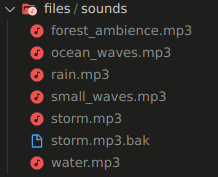

# Noisekun Back-End

_File server of [Noisekun](https://github.com/mateusfg7/Noisekun)_

Made with **Deno** and **Typescript**

### Use:

Create the `files/sounds/` folder and add your own sounds



After, install [Deno Runtime](https://deno.land/) and run by

```bash
$ deno run --allow-net --allow-read server.ts
```

> **--allow-net** _flag to abilite the 'net' permissions_
>
> **--allow-read** _flag to abilite the 'read' permissions_
>
> **server.ts** _main server file_
